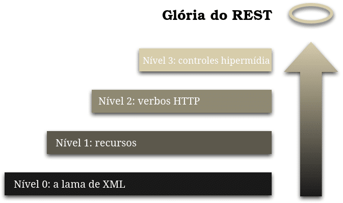
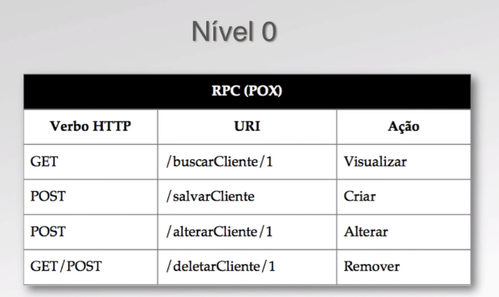
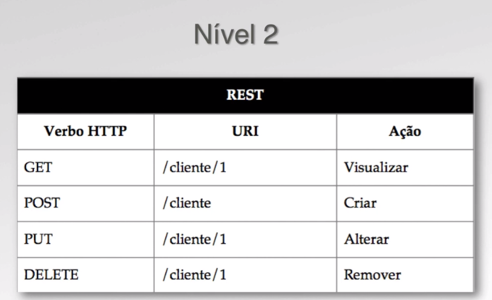

# Curso Algaworks

## Começando com Web Services RESTful e Spring

# Introdução ao REST

## O que é REST?

REST, acrônimo para Representional State Transfer.

Modelo de arquitetura que nos permite criar app escaláveis simples e de forma incremental, na qual a web atualmente é baseada atualmente.

# Considerações sobre WEB:

* Escalável: Pois permite add cada vez mais devices, usuários, web pages e continuar funcionando de forma adequada.

* Incremental: Pois ela evolui cada vez mais(atualizações) e mesmo assim funcionando de forma que o usuário nem perceba, pois recursos anteriores continuam a funcionar ou recebem novas features.

* Simples: Pela forma como a web funciona.

* Extensível: Também pela forma com a web funciona.

* Global: Acessível independente do local, bastando apenas um acesso a internet.

# Considerações sobre REST:

No início dos anos 00, o cientista Roy Fielding escreveu uma tese de doutorado chamada,
Architectural Styles and Design of Network-Based Software Architectures, onde detalha todas as características de que um sistema REST deve possuir. E por ser um modelo o REST não está necessariamente ligado ao HTTP, pois ele é um modelo genérico e o HTTP é um dos protocolos que nos permite implementar um sistema REST.

# Considerações sobre API:

API, acrónimo de Application Programming Interface. APIs permitem que sistemas distintos se interejam por uma interface padrão de comunicação. Com o aumento da internet e a sua escalabilidade a API deixou de ser tratada como um componente técnico e passaram a ser vistas como produtos. Vide Google, Facebook entre outros, que fornecem APIs para que outros sistemas externos consumam dados de suas aplicações.

# O que uma app precisa para ser RESTful:

## Constraints:

* Cliente/Servidor:

Para um determinada app ser RESTful, temos um servidor que gerencia a app e um cliente, geralmente um browser ou outra app, que se comunica com esse servidor.

* Stateless:

Quando uma app é stataless, ela não mantém estado. Quando um cliente faz uma requisição para um servidor, o cliente recebe uma representação dos dados naquele momento, mas sem manter esse mesmo estado no servidor.

* Cache:

Permite que um cliente não faça repetidas requisições para obter a mesma informação. Deixando uma requisição válida por um determinado tempo.

* Interface Uniforme:

Faz uso do conceito de recurso(resource), que é uma informação abstrata de por exemplo,um cliente, produto, pessoa uma tabela do banco de dados, um objeto da qual modelemos ele e acessamos por uma URI(URL), acrônico para Universal Resource Identifier, possibilitando a interação com eles, como por exemplo um CRUD para esse modelo.

* Sistema em Camadas:

Existem elementos intermediários, antes que a requisição chegue ao servidor. Esses sistemas intermediários podem por exemplo, fazer cache,autenticação, log entre outras atividades

* Código sob demanda:

Uma característica que o servidor tem de poder enviar um código para o cliente mudar o comportamento dele, como por exemplo um js enviado pelo servidor ao cliente. Normalmente quando se trata de API,essa técnica não é utilizada. Mas sistemas RESTful de forma geral possuem essa constraint.

* Representações:

É a representação dos conteúdos que os servidores nos retornam quando é feita uma requisição. Essa representação pode ser em formato HTML, XML, JSON entre outros formatos. E de acordo com as necessidades dos clientes, essas representações podem ter formatos diferentes.

* HATEOAS:

Acrônimo para Hypermedia as the Engine of Application State. Uma das constraints de uma app RESTful que é um motor de estados que nos permite que naveguemos em uma app. Como por exemplo, ao requisitar dados de um cliente, a partir desse recurso eu posso ter links para eu atualize, delete ou leve a outras informações, como por exemplo, as compras que esse cliente já fez.

# Partes de uma URI:
[https://developer.mozilla.org/pt-BR/docs/Glossario/URI]

* URI(Uniserval Resource Identifier) -> http://www.site.com/algo

* URL(Uniserval Resource Locator) -> www.site.com

* URN(Uniserval Resource Name) -> algo

# HTTP - Métodos e Respostas:
[https://developer.mozilla.org/pt-BR/docs/Web/HTTP/Status]

## Métodos:

* GET: Utilizado quando existe a necessidade de se obter um recurso

* POST: Utilizamos o método POST quando desejamos criar um recurso

* PUT: Semelhente ao método POST, esse método nos permite a atualização de um recurso já existente.

* DELETE: Como o próprio nome sugere, o DELETE é utilizado quando existe a necessidade de remoção de um recusro.

## Respostas:

Existem cinco categorias de respostas, sendo elas;

* 1xx: Informações gerais

* 2xx: Sucesso

* 3xx: Redirecionamento

* 4xx: Erro no cliente

* 5xx: Erro no servidor

# Representações e o formato JSON

Considerando que tenhamos um recurso chamado cursos e que para obtê-lo usamos o método GET do HTTP com a URN /cursos.

* Content-type: text/html

```
GET /cursos
Content-type: text/html

<html>
  <head>
    <title>::AlgaWorks::</title>
  </head>
  <body>
    <h1>Cursos AlgaWorks</h1>
    <a href="index.html">Cursos</a>
  </body>
</html>
```
Nesse exemplo solicitamos uma representação html do recurso cursos.

* Content-type: application/xml

```
GET /cursos
Content-type: application/xml

<curso>
  <nome>Workshop Rest</nome>
  <instrutor>Emílio Dias</instrutor>
  <duracao>6hs</duracao>
</curso>
```
Nesse exemplo solicitamos uma representação xml do recurso cursos.

* Content-type: application/json

```
GET /cursos
Content-type: application/json

{
  "nome": "Workshop Rest",
  "instrutor": "Emílio Dias",
  "duracao": "6hs"
}
```
Nesse exemplo solicitamos uma representação json do recurso cursos.

Dessa forma, a partir de um determinado recurso, conseguimos obter diferentes sobre ele. O formato no qual o dado é retornado par ao cliente, não necessariamente precisa ser sempre o mesmo. Podemos ter um cliente que solicita xml, outro em json ou html. Dessa forma fica desacoplado o recurso da representação.

# Considerações sobre JSON
[https://developer.mozilla.org/pt-BR/docs/Web/JavaScript/Reference/Global_Objects/JSON]

É um acrônimo para Javascript Object Notation, um formato/sintaxe baseadoem JS, mas que pode ser usado em qualquer plataforma independente da linguagem de programação. É um formato para intercâmbio de dados, para que sistemas consigam se comunicar por meio de uma padronização, no caso o json.

## Notação:

Sitema de caracteres para representar dados, por exemplo números e palavras.

## Portabilidade:

Transmite informações independente da tecnologia utilizada.

## Facilidade de entendimento:

Representa os dados de maneira padronizada em relação aos conceitos universais de programação.

# Sintaxe do JSON

* Objeto

Quando queremos representar um objeto usamos a seguinte notação

```
{
  "nome" : "Workshop Rest",
  "Instrutor" : "Emílio Dias",
  "duracao" : "6hs"
}
```
Esse objeto JSON possui três atributos(nome, instrutor e duracao). Esses atributos são chamados de chave/valor.

```
{
  "nome_da_chave_1" : "valor_1",
  "nome_da_chave_2" : "valor_2",
  .
  .
  .
  "nome_da_chave_n" : "valor_n"
}
```
Sendo que obrigatoriamente o nome dos atributos, as chaves, precisam estar entre aspas, duplas ou simples.

* Lista

Quando queremos representar um objeto usamos a seguinte notação

```
[
  {
    "nome" : "Workshop Rest",
    "Instrutor" : "Emílio Dias",
    "duracao" : "6hs"
  },
  {
    "nome" : "Workshop Spring",
    "Instrutor" : "Normandes Junior",
    "duracao" : "6hs"
  }
]
```
Nesse caso temos uma lista de objetos separados por vírgula que são delimitados por colchetes.

* Lista vazia

```
[]
```

* Números, Strings, Objetos e Booleanos

No JSON também conseguimor atribuir vários tipos de dados para os seus atributos. Números, que podem ser inteiros ou flutuantes, strings, objetos ou booleanos.

```
{
  "nome" : "Workshop Rest",
  "Instrutor" : { "nome" : "Emílio Dias" },
  "duracao" : 6,
  "ativo" : true
}
```

Note que nesse exemplo temos também um atributo que é um objeto. Também poderiamos ter um atributo que é uma lista. E note também que para os tipos número e booleano, não necessitamos das aspas.

# Modelo de Maturidade Richardson
[Modelo de Maturidade Richardson](https://boaglio.com/index.php/2016/11/03/modelo-de-maturidade-de-richardson-os-passos-para-a-gloria-do-rest/)

[Richardson Maturity Model](https://martinfowler.com/articles/richardsonMaturityModel.html)



É um modelo proposto por Leonard Richardson, propõe que considerando como a maioria das aplicações são construidas, elas seguem um modelo RPC(Remote Procedure Call), que basicamente é a exposição de métodos para execução remota. Funções ou métodos que são expostas para serem executadas de forma remota. O modelo ajuda a determinar em quel nível de maturidade a nossa app/api está.

Como podemos ver na imagem acima do Modelo de Maturidade Richardson, de baixo para cima, temos:

## Nível 0: The Swamp of POX

POX(Plain Old XML), é nível mais baixo e pobre de comunicação, que não pode nem mesmo ser considerado RESTful, apesar de ter parte dos conceitos envolvidos.

Suas principais caracteristicas são:

* Modelo RPC

  * Expões métodos/funções para execução remota através de uma URI

* HTTP apenas como transporte

  * Apesar de não ser obrigatório no RESTful, ele é utilizado apenas como transporte, nenhuma das caracteristicas ou das funcionalidades que o HTTP fornece é utilizado para o desenvolvimento da API. O que nos remete a desenvolver tudo na camada de negócio.

* Semelhante ao uso de SOAP ou XML-RPC

  * SOAP é um protocolo que trabalha com RPC e que independe do transporte(HTTP, JMS)

  * E o modelo XML-RPC é a execução de um XML no modelo RPC.


Exemplo de uma API nível 0:

```
POST /salvarCliente HTTP/1.1

<cliente>
  <nome>João da Silva</nome>
  <nascimento>01/01/1970</nascimento>
</cliente>
```

OBS: No caso dessa URI ela está mapeada com um verbo, pois trata-se do nível 0, mas o correto é utilizar substantivos para fazer o seu mapeamento acima desse nivel.

No caso de uma API nível 0, os verbos utilizados são POST e GET.



## Nível 1: Resources

Quando se trata do nível 1, o mínimo que temos que fazer é mapear recursos(resources) ao invés de utilizarmos verbos para mapear a nossa URI.

Exemplo de uma API nível 1:

```
POST /clientes HTTP/1.1

<cliente>
  <nome>João da Silva</nome>
  <nascimento>01/01/1970</nascimento>
</cliente>
```

## Nível 2: HTTP Verbs

Depois de mapeados os recursos, agora podemos utilizar o protocolo HTTP de forma correta, consequentemente no levando para o nível 2, usando métodos e respostas.

* Métodos(HTTP Verbs)
  * GET
  * POST
  * PUT
  * DELETE

```
POST /clientes HTTP/1.1

<cliente>
  <nome>João da Silva</nome>
  <nascimento>01/01/1970</nascimento>
</cliente>
```

Dessa forma, podemos fazer uso das repostas do HTTP, exemplo do retorno de uma possível resposta ao método POST executado acima.

```
HTTP/1.1 201 Created
Location: /cliente/1
```



## Nível 3: Hypermedia Controls

O nível3, tem o que chamamos de motor de estado. A web como um todo é baseada em hypermedia. Se por exemplo acessarmos um conteúdo em index.html, além do conteúdo desse index.html, também será retornado links para outras páginas. Então a partir do index.html poderiamos ir para produtos.html, para clientes.html, contato.html ou carrinho.html. Então ao receber uma representação do index.html teremos links que nos levam para outros estados.


Exemplo de um html:

```
<html>
  <body>
    <a href="produtos.html">Produtos</a>
    <a href="clientes.html">Clientes</a>
    <a href="contato.html">Contato</a>
    <a href="carrinho.html">Carrihno</a>
  </body>
</html>
```

Exemplo de uma API nível 3:

```
GET /cliente/1 HTTP/1.1

HTTP/1.1 200 OK

<cliente>
  <id>1</id>
  <nome>João da Silva</nome>
  <link rel="deletar" href="/cliente/1" />
  <link rel="notificar" href="/cliente/1/notificar" />
</cliente>
```
Acima temos a solicitação do recurso cliente pelo método `GET` e logo depois a resposta. Com dois links, deletar e notificar. E como que o cliente que consome essa API sabe que o deletar deve usar o método `DELETE` e o notíficar um outro tipo de método(`GET`,`POST`,`PUT`)? O significado desse relacionamento `rel="deletar"` ou `rel="notificar"` deve ser previamente combinado entre e o servidor e o cliente. Deve existir uma semântica, onde o cliente ao encontrar um relacionamento `rel="deletar"` deve se usar o método `DELETE`. De forma semelhante acontece no browser, pois ele sabe que ao encontar a tag `a` com o `href`, ele deve executar o método `GET` por convenção.

[Veja também sobre HATEOAS](https://www.youtube.com/watch?v=M5NWpt5d59E)

# Criação do Projeto

Optei por usar o VS Code nesse projeto. Para criar um projeto Spring veja esse [vídeo](https://www.youtube.com/watch?v=dkmlOi_MNb4).

Documentações para auxiliar:

[Lombok](https://github.com/rzwitserloot/lombok/wiki)

[Spring JPA](https://docs.spring.io/spring-data/jpa/docs/current/reference/html/#reference)

[Hibernate JPA](https://docs.jboss.org/hibernate/jpa/2.1/api/overview-summary.html)

# Criando uma API RESTful

## Considerações

* Analogia: 
  * Resources = Controllers
  * Entities/Domain = Models
  * Repositories = DAO
  * Services = Regras de Negócio

## [Entendendo o Lazy e o Eager Load da JPA](https://blog.caelum.com.br/entendendo-o-lazy-e-o-eager-load-da-jpa/)

Por padrão, quando o relacionamento está anotado com @OneToOne ou @ManyToOne ele é carregado de modo Eager ou seja, quando fizemos qualquer tipo de busca na entidade como por exemplo um find(Aluno.class, 1) ele será carregado junto com a entidade e nesse caso a JPA executará uma query só.

Por padrão quando o relacionamento está anotado com @OneToMany ou @ManyToMany ele é carregado de modo Lazy ou seja, quando fizemos qualquer tipo de busca na entidade como por exemplo um find(Aluno.class, 1) ele não será carregado junto com a entidade, somente quando executarmos o comando getMatriculas() o relacionamento será carregado.

Por o modo Lazy só carregar as informações quando executamos um getter fazer um aluno.getMatriculas().getCodigo() dentro de um for para pegar o código de todas as matriculas do aluno pode trazer problema de performance à aplicação, pois a JPA executará várias queries.
